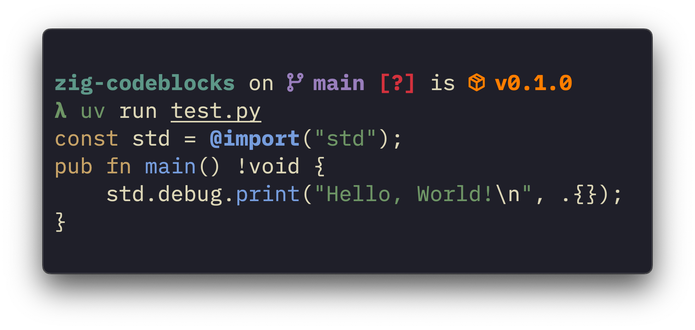
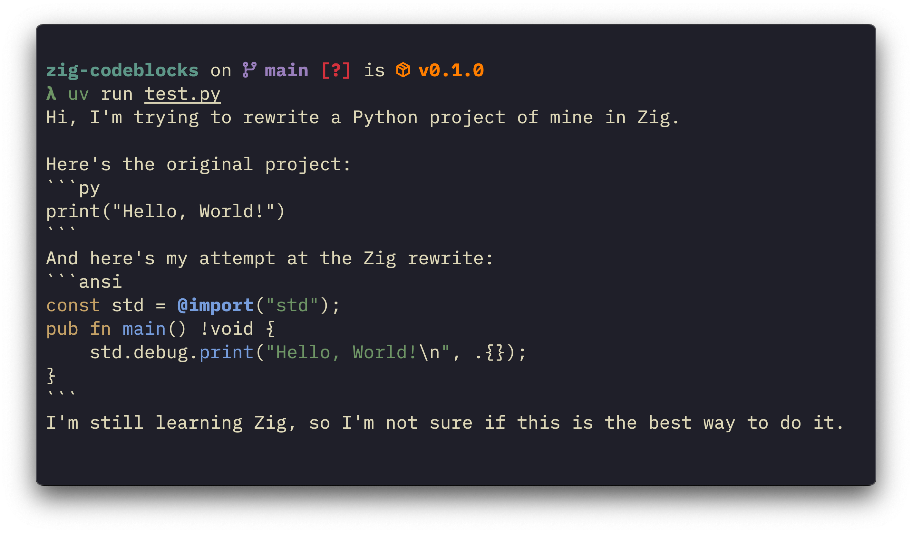

[](https://github.com/astral-sh/uv)
[](https://github.com/astral-sh/ruff)

# zig-codeblocks

`zig-codeblocks` is a Python 3.10+ library for adding syntax highlighting to Zig
code blocks in Markdown files through ANSI escape codes. Originally intended for
patching the lack of syntax highlighting for Zig on Discord.


## Installation
`zig-codeblocks` is available on PyPI:
```sh
pip install zig-codeblocks
```
You can also install it from source:
```sh
pip install git+https://github.com/trag1c/zig-codeblocks.git
```


## API Reference

### `extract_codeblocks`
```py
def extract_codeblocks(source: str) -> Iterator[Codeblock]
```
Yields [`CodeBlock`](#codeblock)s from a Markdown source.

**Example usage:**
```py
from pathlib import Path

from zig_codeblocks import extract_codeblocks

source = Path("examples/riiz.md").read_text()
for codeblock in extract_codeblocks(source):
    print(f"Language: {codeblock.lang}")
    print(f"Body:\n{codeblock.body}")
```
```
Language: py
Body:
print("Hello, World!")

Language: zig
Body:
const std = @import("std");
pub fn main() !void {
    std.debug.print("Hello, World!\n", .{});
}
```


### `highlight_zig_code`
```py
def highlight_zig_code(source: str) -> str
```
Returns an ANSI syntax-highlighted version of the given Zig source code.

**Example usage:**
```py
from pathlib import Path

from zig_codeblocks import highlight_zig_code

source = Path("examples/hello_world.zig").read_text()
print(highlight_zig_code(source))
```



### `process_markdown`
```py
def process_markdown(source: str, *, only_code: bool = False) -> str
```
Returns a Markdown source with Zig code blocks syntax-highlighted.
If `only_code` is True, only processed Zig code blocks will be returned.

**Example usage:**
```py
from pathlib import Path

from zig_codeblocks import process_markdown

source = Path("examples/riiz.md").read_text()
print(process_markdown(source))
```



### `CodeBlock`
```py
class CodeBlock(NamedTuple):
    lang: str
    body: str
```
A code block extracted from a Markdown source.


## License
`zig-codeblocks` is licensed under the [MIT License].  
© [trag1c], 2025

[MIT License]: https://opensource.org/license/mit/
[trag1c]: https://github.com/trag1c/
