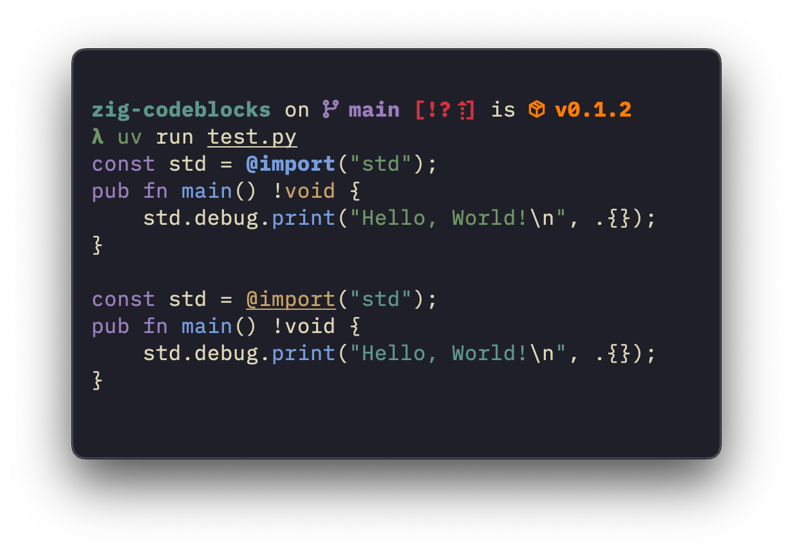

[](https://github.com/astral-sh/uv)
[](https://github.com/astral-sh/ruff)

# zig-codeblocks

`zig-codeblocks` is a Rust-powered CPython 3.9+ library for adding syntax
highlighting to Zig code blocks in Markdown files through ANSI escape codes.
Originally intended for patching the lack of syntax highlighting for Zig on
Discord.


## Installation
`zig-codeblocks` is available on PyPI:
```sh
pip install zig-codeblocks
```
You can also install it from source:
```sh
pip install git+https://github.com/trag1c/zig-codeblocks.git
```
---
`zig-codeblocks` also exposes a CLI via a `cli` extra:
```py
pip install "zig-codeblocks[cli]"
```
If the CLI is all you need, you can run it with `uvx`:
```sh
uvx "zig-codeblocks[cli]" --help
```


## API Reference

### `extract_codeblocks`
```py
def extract_codeblocks(source: str | bytes) -> list[CodeBlock]
```
Yields [`CodeBlock`](#codeblock)s from a Markdown source.
Assumes UTF-8 if source is `bytes`.

**Example usage:**
```py
from pathlib import Path

from zig_codeblocks import extract_codeblocks

source = Path("examples/riiz.md").read_text()
for codeblock in extract_codeblocks(source):
    print(f"Language: {codeblock.lang}")
    print(f"Body:\n{codeblock.body}")
```
```
Language: py
Body:
print("Hello, World!")

Language: zig
Body:
const std = @import("std");
pub fn main() !void {
    std.debug.print("Hello, World!\n", .{});
}
```


### `highlight_zig_code`
```py
def highlight_zig_code(source: str | bytes, theme: Theme = DEFAULT_THEME) -> str
```
Returns an ANSI syntax-highlighted version of the given Zig source code.
Assumes UTF-8 if source is `bytes`.
An optional [`Theme`](#theme) can be supplied (defaults to
[`DEFAULT_THEME`](#default_theme)).

**Example usage:**
```py
from pathlib import Path

from zig_codeblocks import DEFAULT_THEME, Color, Style, highlight_zig_code

source = Path("examples/hello_world.zig").read_text()

theme = DEFAULT_THEME.copy()
theme["BuiltinIdentifier"] = Style(Color.Orange, underline=True)
theme["String"] = Style(Color.Cyan)
del theme["Type"]

print(
    highlight_zig_code(source),
    highlight_zig_code(source, theme),
    sep="\n\n",
)
```



### `process_markdown`
```py
def process_markdown(
    source: str | bytes,
    theme: Theme = DEFAULT_THEME,
    *,
    only_code: bool = False,
) -> str
```
Returns a Markdown source with Zig code blocks syntax-highlighted.
Assumes UTF-8 if source is `bytes`.
An optional [`Theme`](#theme) can be supplied (defaults to
[`DEFAULT_THEME`](#default_theme)).
If `only_code` is True, only processed Zig code blocks will be returned.

**Example usage:**
```py
from pathlib import Path

from zig_codeblocks import process_markdown

source = Path("examples/riiz.md").read_text()
print(process_markdown(source))
```


### `CodeBlock`
```py
class CodeBlock:
    lang: str
    body: str
```
A code block extracted from a Markdown source. Immutable.


### `Color`
```py
class Color(Enum):
    Gray = "30"
    Red = "31"
    Green = "32"
    Orange = "33"
    Blue = "34"
    Magenta = "35"
    Cyan = "36"
    White = "37"  # Black for light mode
```
An enumeration of 3-bit ANSI colors.
Some names were adjusted to match Discord's style.
A color can be instantiated from a string too: `Color.from_string("Blue")`.


### `Style`
```py
class Style:
    color: Color
    bold: bool = False
    underline: bool = False
```
A style for syntax highlighting.
Takes a [`Color`](#color) and can optionally be bold and/or underlined.
Immutable.
Produces an SGR sequence when converted to a string.


### `Theme`
```py
class Theme(TypedDict, total=False):
    BuiltinIdentifier: Style
    Call: Style
    Comment: Style
    Identifier: Style
    Keyword: Style
    Numeric: Style
    PrimitiveValue: Style
    String: Style
    Type: Style
```
A theme dict for syntax highlighting Zig code.
Each key is optional and can be provided a [`Style`](#style) to apply to the
corresponding token type.
Can be instantiated with a dict literal or with a `Theme` call:
```py
from zig_codeblocks import Color, Style, Theme

theme_foo = Theme(
    Numeric=Style(Color.Blue),
    String=Style(Color.Green),
)

theme_bar: Theme = {
    "Numeric": Style(Color.Blue),
    "String": Style(Color.Green),
}

assert theme_foo == theme_bar
```


### `DEFAULT_THEME`
The default theme used for highlighting, defined as follows:
```py
DEFAULT_THEME: Theme = {
    "BuiltinIdentifier": Style(Color.Blue, bold=True),
    "Call": Style(Color.Blue),
    "Comment": Style(Color.Gray),
    "Keyword": Style(Color.Magenta),
    "Numeric": Style(Color.Cyan),
    "PrimitiveValue": Style(Color.Cyan),
    "String": Style(Color.Green),
    "Type": Style(Color.Orange),
}
```


## License
`zig-codeblocks` is licensed under the [MIT License].  
© [trag1c], 2025

[MIT License]: https://opensource.org/license/mit/
[trag1c]: https://github.com/trag1c/
